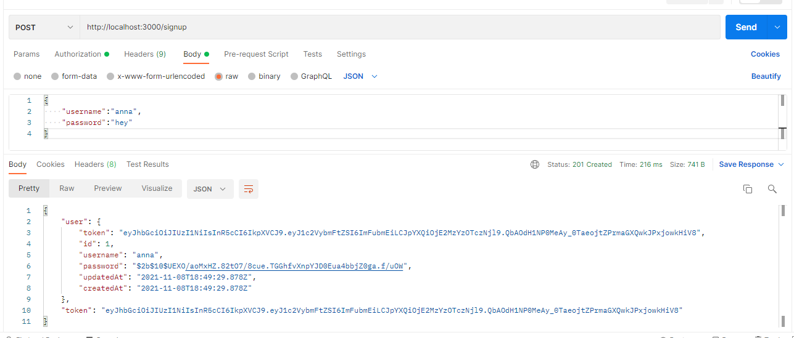
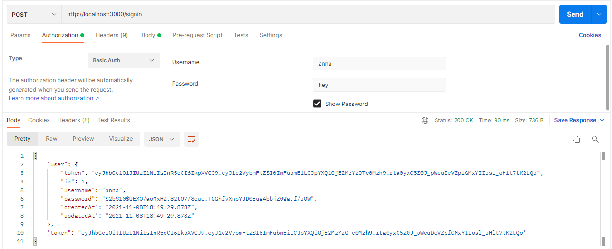
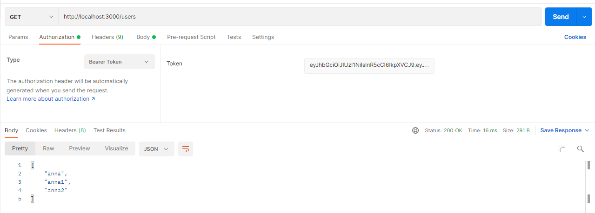
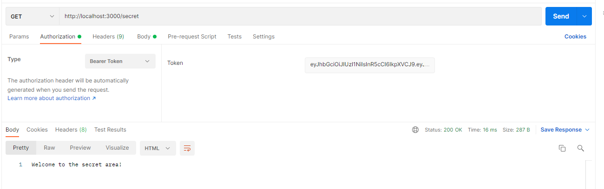
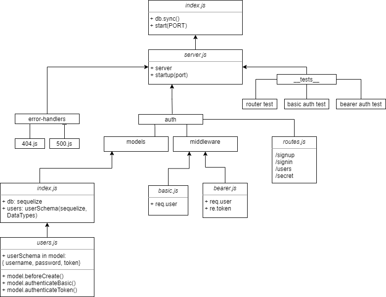

# bearer-auth-h

## Description

This API is able to allow a user to create an account as well as to handling basic authentication (user provides a username + password). When a “good” login happens, the user is considered to be “authenticated” and  a JWT token is generated and signed for them.

## Links

* Heroku:
* PR: 

## Endpoint Results

* post `/signup`:

* post `/signin`:

* get `/users`:

* get `/secret`:

## UML

